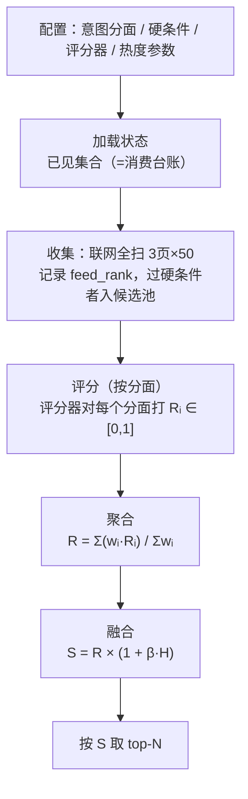

# 筛选算法

从 MJ 热榜到选品清单的完整筛选流程、公式与原理。

> 对应实现：tools/collector/filter.py（硬条件、热度、融合）和 tools/collector/scorers.py（相关度评分器）

> 参数配置：config/collector.json

---

## 1. 设计目标

算法的每个决策都为了更好地实现这些目标，符合这些决策：

| 目标、决策                 | 含义                                                                                           | 推论                                                       |
| -------------------------- | ---------------------------------------------------------------------------------------------- | ---------------------------------------------------------- |
| 质量只挂平台热度           | 项目不依赖视觉识别评价质量，质量完全交给 Midjourney 自己的热榜排序（当然还有我后期的手动增删） | 热度 H 只能是位置的函数                                    |
| 榜单前面有明显高原         | 平台优秀作品很多，排名前段的作品应视作一样优秀（至少以我的审美，多次观察后感觉是这样）         | H 是"前 K 名满分持平"的高原形，不是线性递减                |
| 热度是微调项               | 相关度是主项，热度权重要低，因为审美确实很主观                                                 | 融合用乘性加成，零相关永远垫底                             |
| 相关度要能泛化             | "少女"要能命中 young woman/girl甚至beauty，跨语种与词句都要有转化能力                          | 语义评分（本地模型 / LLM）为主力（本地模型优先），词法最后 |
| 尽量少参、可解释、保证产出 | 本地模型能力有限；每条入选要能解释；筛不满也要给结果                                           | 连续评分 + 软化 + 分数写回                                 |

---

## 2. 流程



## 3. 相关度 R

### 3.1 显然要带权

早期版本把意图当整段文本打一个分，结果"抽象"的图会稀释"少女"的权重（我想要少女，少女是主体，抽象只是附加描述风格），所以现在意图是**带权的**：

```
eg（现在）： --intent "少女肖像10，偏抽象2，个性化5"
```

### 3.2 聚合公式

$$
R = \frac{\sum_{i} w_i \cdot R_i}{\sum_{i} w_i}
$$

**采用加权平均**

| 作品                           | R_少女 | R_抽象 | 加权平均  | 加权乘积 |
| ------------------------------ | ------ | ------ | --------- | -------- |
| 很抽象、无少女（曾经的错选项） | 0.1    | 0.9    | **0.233** | 0.09     |
| 少女强、不太抽象               | 0.8    | 0.3    | **0.717** | 0.24     |

两种聚合都能纠正错选，但乘积对向量噪声敏感：任一分面偶然打低分就重创总分，误杀好图。加权平均平滑且可预测

### 3.3 **评分**

同一聚合公式下，Rᵢ 的来源有三种，外加一种混合：

| 评分器                  | Rᵢ 来源                                                                                                                 | 特点                               |
| ----------------------- | ----------------------------------------------------------------------------------------------------------------------- | ---------------------------------- |
| **embedding**（最优先） | 在hf找的一个只有240MB的本地向量余弦相似度校准模型，实际效果很好（主要是用llm太贵了，试了一下，平均每轮筛选7分钱（ds）） | 白嫖、离线                         |
| **hybrid**              | 全量用 embedding 粗筛，仅 评出来的前几 交给 LLM 精评                                                                    | token 省约 8 成，终选段质量≈纯 LLM |
| **llm**                 | LLM 按分面逐项打分（0-10 → /10）                                                                                        | 贵                                 |
| **lexical**             | 分面文本词法命中（命中 1 / 未命中 0）                                                                                   | 屎                                 |

auto = llm → embedding → lexical 逐级降级；hybrid 的 LLM 段失败自动沿用向量分。

**向量校准**（embedding）：

$$
R_i = \mathrm{clip}\left(\frac{\cos(\text{分面}_i,\ \text{prompt}) - L(n)}{0.65 - L(n)},\ 0,\ 1\right)

L(n) 是随 prompt token 数 n 变化的零点（短文本降噪，越短入场券越贵）：
L(n) = 0.50（n≤6）→ 线性 → 0.20（n≥20）
$$

校准区间来自实测分布：无关 ≈ −0.03~0.18、关键词堆砌 ≈ 0.29、真正相关 ≈ 0.32~0.75、跨语种命中 ≈ 0.61~0.65。超短碎片 prompt（DIGITAL/홍조 级）噪声会顶到 0.3~0.5，靠 L(n) 抬零点压掉——注意真命中（A robot，cos 0.97）照样满分，因为分开真伪的不是长度而是 cos 本身。模型为 `paraphrase-multilingual-MiniLM-L12-v2`（fastembed 量化 ONNX，约 240MB，本地 `models/` 缓存）

**LLM 评分规**（llm / hybrid 精评段）：温度 0，锚点 0=无关 / 2=沾边 / 4=部分相关 / 6=比较贴合 / 8=很贴合 / 10=完美贴合，强制区分度、只看 prompt 可推断内容、尾部堆砌不算贴合；输出分项分与分项理由的 JSON，聚合仍由本地公式完成（保证跨评分器行为一致）。两段式：全量打分后对 top精评条数 放在一起重校准，缓解 LLM 分数压缩在 6-7 分区间的问题。

---

## 4. 热度 H

### 4.1 位置是唯一额外内容，没招，不充钱就这样，只能看 top150，不能筛选不能搜索不能主动排序

免登录接口（登陆不充钱也一样）只有一种排序（feed 参数被忽略），返回的是平台内部的热度/推荐序，**不是时间序**；原始数据里没有任何 likes/score/rank 数值字段；排序高度稳定（30 秒后前 50 名一字不差）

### 4.2 高原形公式

$$
H(\text{rank}) =
\begin{cases}
1.0 & \text{rank} \le K \\[4pt]
\dfrac{M - \text{rank}}{M - K} & K < \text{rank} \le M \\[6pt]
0 & \text{rank} > M
\end{cases}
$$

这个非常主观了，我的审美来看这个格式有效

当前：

- H = 0.5、K=75、M=150

---

## 5. 总分 S 与选品

### 5.1 乘性融合

$$
S = R \times (1 + \beta \cdot H), \qquad \beta = 0.5 \ \text{（当前默认）}
$$

**乘性而不是加性**

废话，因为热度与选题相互独立（对我而言，对平台就不知道了，也不关我的事）

加而且性（R + βH）会让零相关的热榜头名拿嫖 β 的保底分，可能压过弱相关作品。乘性之下 R = 0 则 S = 0，热度只能在**相关作品之间**拉开差距。性质：

- 热度的最大话语权就是 β：同等 R 下，榜首对榜尾的相对优势不超过 1+β 倍；
- 当前 β=0.5（初期设计为 0.1，实测后调整——热榜尾部作品质量断崖，需要热度把它们压下去）；
- H 的高原形保证前 75 名内部 H 相同，这一段纯按 R 竞争。

### 5.2 软门槛与择优

$$
\text{排序键} = \big(\,[R \ge r_{\min}],\ \ S\,\big) \ \text{降序} \qquad (r_{\min} = 0.2)
$$

同分保持抓取序，稳定、可复现

## 6. 硬条件

| 条件                   | 规则                              |
| ---------------------- | --------------------------------- |
| 排除关键词             | 命中任一即弃                      |
| 画幅                   | 严格匹配列表（如 `9:16 3:4`）     |
| prompt 字数            | 上下限区间                        |
| 包含关键词（语义模式） | **全部必须命中**（AND），不进权重 |

### 词边界与通配符

所有关键词匹配走同一套规则，正则为 `(?<![a-z0-9])文本(?![a-z0-9])`（前后不能是字母数字，对中文同样成立）：

| 写法     | `girl` 命中 girls | 命中 cowgirl | 说明                   |
| -------- | ----------------- | ------------ | ---------------------- |
| `girl`   | ✗                 | ✗            | 严格整词               |
| `girl*`  | ✓                 | ✗            | 词尾放宽（复数、变形） |
| `*girl`  | ✓                 | ✓            | 词首放宽               |
| `*girl*` | ✓                 | ✓            | 子串（旧行为）         |

配套语义：`realistic` 不命中 `photorealistic`（风格词不同义）；要包含就写 `*realistic` 或干脆把 `photorealistic` 列为同义分面。词法模式下同义词直接放关键词列表，权重机制天然支持

---

## 7. 状态机制（不重复、不复活、不覆盖）

不详细展开，基础操作，没啥意思

### 评分结果写回（可解释性）

每条入选条目带 `match` 块，错选一眼定位是哪个分面拉的分：

```json
"match": {
  "relevance": 0.69,
  "heat": 1.0,
  "score": 1.035,
  "rank": 5,
  "why": "主分面[少女肖像] 向量相似度 0.621",
  "facets": [
    {"text": "少女肖像", "weight": 10, "score": 0.936, "why": "向量相似度 0.621"},
    {"text": "个性化",   "weight": 5,  "score": 0.355, "why": "向量相似度 0.360"},
    {"text": "偏抽象",   "weight": 2,  "score": 0.301, "why": "向量相似度 0.335"}
  ]
}
```

---

## 8. 参数速查

| 参数（config 路径）              | 含义                                      | 当前默认           | 调整建议                               |
| -------------------------------- | ----------------------------------------- | ------------------ | -------------------------------------- |
| `筛选.意图`                      | 分面 + 权重                               | 空                 | 日常主入口；优先级用权重表达           |
| `筛选.目标条数`                  | 清单新增 top-N                            | 5                  | 按每期需要 6–10 图留余量               |
| `筛选.包含关键词`                | 语义模式 = AND 硬闸；词法模式 = 打分素材  | []                 | "绝对必须"才用                         |
| `筛选.排除关键词`                | 命中任一即弃                              | []                 | 风格反义词写这里                       |
| `评分.评分器`                    | embedding / hybrid / llm / lexical / auto | embedding          | 日常用 embedding；终选前换 hybrid      |
| `评分.热度权重` β                | 热度话语权上限                            | 0.5                | 嫌热榜尾部丑 → 调大；嫌热度干扰 → 调小 |
| `评分.热度高原` K                | 前 K 名热度满分                           | 75                 | "头部高原"的宽度                       |
| `评分.热度终点` M                | 此后热度分为 0                            | 150                | ≈ 可见榜深度（3 页 × 50）              |
| `评分.最低相关分` r_min          | 软门槛                                    | 0.2                | 调高 = 更挑但可能空手（会放宽并提示）  |
| `评分.精评条数`                  | hybrid 交给 LLM 的名额                    | 30                 | 约目标条数的 3–6 倍                    |
| `评分.嵌入模型` / `嵌入缓存目录` | 向量模型与本地缓存                        | MiniLM / `models/` | 换模型需重测校准区间                   |
| `评分.LLM接口/模型/密钥`         | OpenAI 兼容接口                           | DeepSeek           | 密钥放 `.env`，不进 git                |

---

## 9. 已知局限

1. **prompt 文本 ≠ 画面内容**，但是在有限预算内应该是难以解决的，我不太了解图像模型的下限，不敢用
2. **128 token 截断**。向量模型只看 prompt 开头，相关信息写在极尾部会丢；但某种意义上来看 MJ prompt 主体在前，且截断压制了堆砌，甚至因祸得福，牛逼（而且ai生图有个东西叫反提示词，一般prompt很长很复杂才有（被放最后），会影响我的相似度判断，但 128 token 天然隔绝了这种长尾巴，牛逼）
3. **LLM 分数压缩**。绝对打分爱挤在 6–7 分，靠量规锚点 + 两段式重校准缓解；评分器切换时排序可能小幅变动。
4. **热度是唯一额外信息，且居然隔一会会变，难绷**。位置只表示"平台当下的排序"，不表示绝对质量；K/M 折的是可见榜深度，榜单滚动后旧 rank 依然留在条目里（它是"当时的位置"）

---

## 10. 演化史

| 版本          | 机制                                    | 缺点                                    |
| ------------- | --------------------------------------- | --------------------------------------- |
| v1 离散权重   | 关键词 100/50/25/10 阈值 125 + 翻页降分 | 离散刻度无泛化；诡异魔法数字互相纠缠    |
| v2 连续评分   | S = R × (1 + βH)，R 仍来自关键词归一    | 词法天花板：girls/woman/少女/多语种全漏 |
| v3 语义评分   | 向量 / LLM 分面打分 + 加权平均          | 没权，我想看抽象画风少女而不是抽象泥哥  |
| v3.1 分面加权 | 意图 = 带权分面，逐分面打分后加权平均   | （当前版本）                            |

暂时就在这样吧，暂时感觉也够用了，后续最多也就微调/换本地模型了
